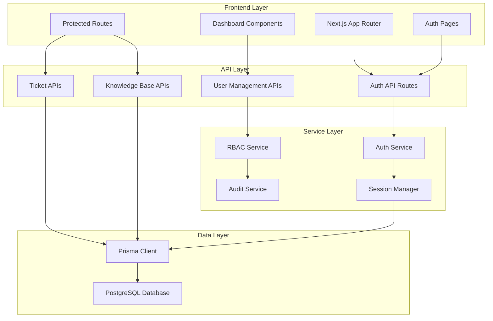

# Design Document

## Overview

This design focuses on the foundational step: setting up the database with Prisma, implementing basic user authentication (register/login), and establishing the core project structure. We'll build incrementally, starting with just the essential authentication system before adding role-based access control and business features.

## Architecture

### High-Level Architecture



### Initial Project Structure (Phase 1 Only)

```
project-root/
├── prisma/
│   ├── schema.prisma          # Your provided schema (focus on User, UserSession tables)
│   └── migrations/            # Database migrations
├── src/
│   ├── app/                  # Next.js App Router
│   │   ├── login/           # Login page
│   │   ├── register/        # Register page
│   │   ├── dashboard/       # Simple protected dashboard
│   │   ├── api/             # API routes
│   │   │   └── auth/        # Auth endpoints only
│   │   │       ├── register/
│   │   │       ├── login/
│   │   │       └── logout/
│   │   └── globals.css
│   ├── components/          # Keep existing UI components
│   ├── lib/                 # Utilities and services
│   │   ├── auth.ts         # Basic auth utilities
│   │   ├── db.ts           # Prisma client setup
│   │   └── utils.ts        # Existing utilities
│   └── middleware.ts       # Basic auth middleware
├── .env.local              # Database URL and auth secrets
└── package.json
```

## Components and Interfaces

### Authentication System

#### Auth Service Interface
```typescript
interface AuthService {
  register(email: string, password: string, name?: string): Promise<User>
  login(email: string, password: string): Promise<{ user: User, session: UserSession }>
  logout(sessionToken: string): Promise<void>
  validateSession(token: string): Promise<User | null>
  refreshSession(token: string): Promise<UserSession>
}
```

#### Session Management
- JWT-based tokens stored in UserSession table
- Automatic session cleanup for expired tokens
- Secure httpOnly cookies for token storage
- Session validation middleware for protected routes

### RBAC System

#### Permission Structure
```typescript
interface Permission {
  resource: string    // 'tickets', 'users', 'knowledge_base'
  action: string      // 'read', 'write', 'delete', 'manage'
}

interface UserPermissions {
  userId: string
  permissions: Permission[]
  roles: Role[]
}
```

#### Role Hierarchy
- **Admin**: Full system access, user management, system settings
- **Manager**: Team oversight, advanced reporting, user role assignment
- **TeamLeader**: Team ticket management, knowledge base editing
- **User**: Basic ticket creation and viewing, public knowledge base access

### API Route Structure

#### Initial API Routes (Phase 1 Only)
- `POST /api/auth/register` - User registration
- `POST /api/auth/login` - User login  
- `POST /api/auth/logout` - User logout

**Note:** We'll add session validation, user management, and business logic APIs in later phases.

## Data Models

### Core Authentication Models
The system uses your provided Prisma schema with these key relationships:

- **User** ↔ **UserRole** ↔ **Role** ↔ **RolePermission** ↔ **Permission**
- **User** ↔ **UserSession** (1:many for multiple active sessions)
- **User** ↔ **AuditLog** (comprehensive activity tracking)

### Business Logic Models
- **Customer** ↔ **Ticket** (customer support tickets)
- **Ticket** ↔ **Comment** (ticket conversations)
- **Ticket** ↔ **TicketTag** ↔ **Tag** (ticket categorization)
- **KnowledgeBaseArticle** with access level controls
- **Setting** for system configuration

## Error Handling

### API Error Response Format
```typescript
interface APIError {
  error: string
  message: string
  statusCode: number
  details?: any
}
```

### Error Categories
- **Authentication Errors** (401): Invalid credentials, expired sessions
- **Authorization Errors** (403): Insufficient permissions
- **Validation Errors** (400): Invalid input data
- **Database Errors** (500): Connection issues, constraint violations
- **Rate Limiting** (429): Too many requests

### Error Logging
All errors logged to AuditLog table with:
- User context (if authenticated)
- Request details (IP, user agent)
- Error stack traces (in development)
- Timestamp and severity level

## Security Considerations

### Password Security
- bcrypt hashing with salt rounds (minimum 12)
- Password strength requirements (8+ chars, mixed case, numbers, symbols)
- Account lockout after failed attempts

### Session Security
- Secure, httpOnly cookies
- CSRF protection with tokens
- Session rotation on privilege escalation
- Automatic cleanup of expired sessions

### Database Security
- Parameterized queries through Prisma (SQL injection prevention)
- Row-level security through RBAC checks
- Audit logging for all sensitive operations
- Database connection pooling and encryption

### API Security
- Rate limiting per user/IP
- Input validation and sanitization
- CORS configuration for production
- Request size limits

## Testing Strategy

### Unit Testing
- Authentication service functions
- RBAC permission checking logic
- Database model validations
- Utility functions

### Integration Testing
- API route functionality
- Database operations with transactions
- Authentication flow end-to-end
- Permission-based access control

### Security Testing
- Authentication bypass attempts
- SQL injection prevention
- XSS protection validation
- Session management security

## Implementation Approach

### Current Focus: Core Authentication Foundation

**What we'll build first:**
1. Database setup with Prisma and PostgreSQL
2. Basic User model and authentication tables
3. Simple register/login functionality
4. Basic session management
5. Login and register pages

**What we'll build later (separate specs):**
- Role-based access control system
- Business logic (tickets, customers, knowledge base)
- Advanced audit logging
- User management interfaces

### Minimal Viable Authentication

The initial implementation will focus on:
- User registration with email/password
- User login with session creation
- Basic session validation
- Simple logout functionality
- Minimal UI for auth pages

This approach ensures we have a solid foundation before adding complexity.